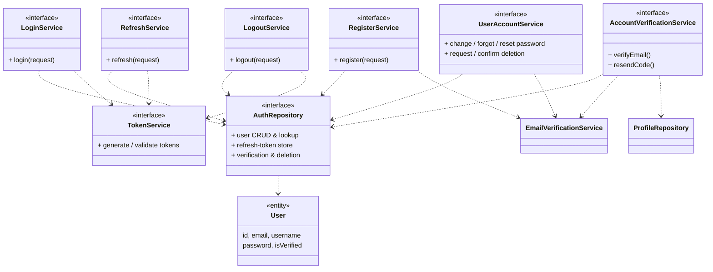
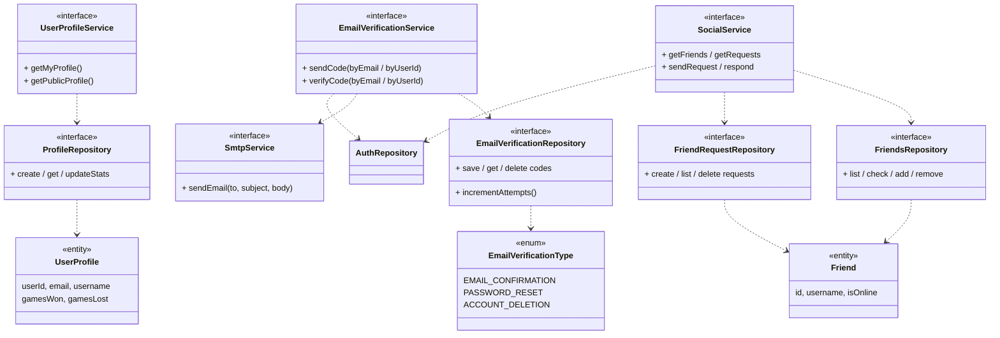
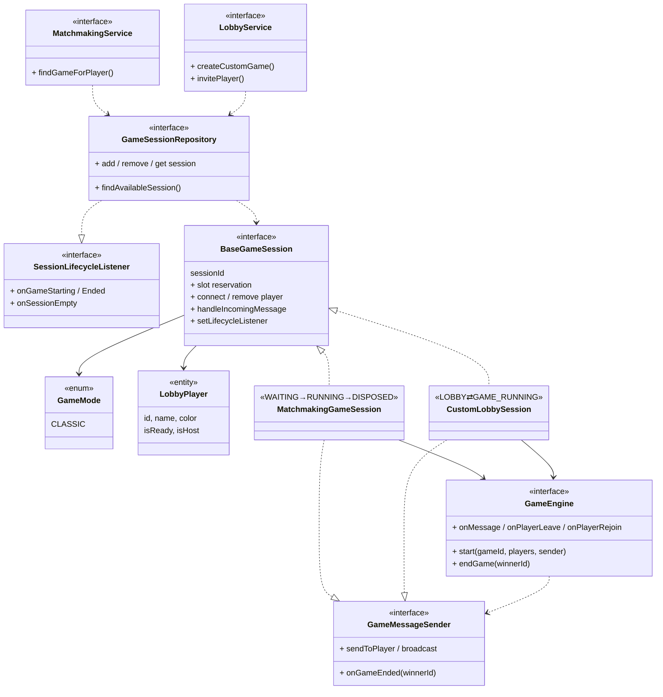
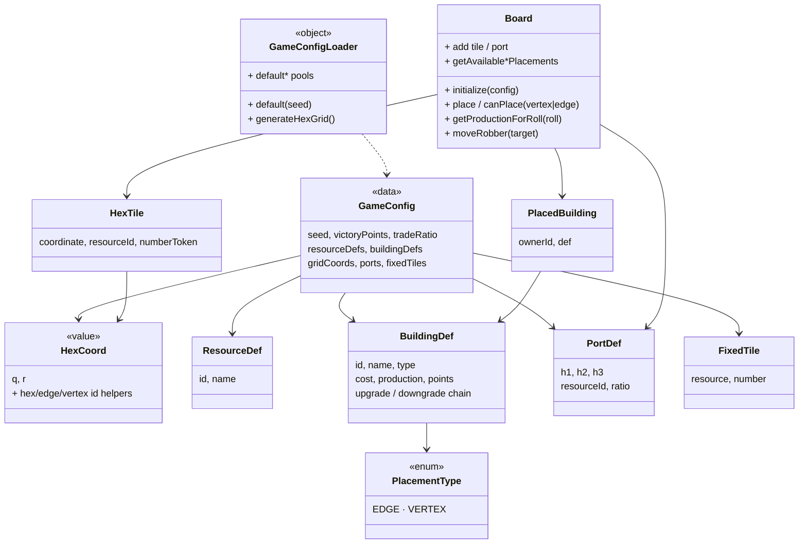
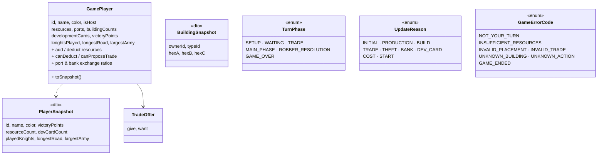
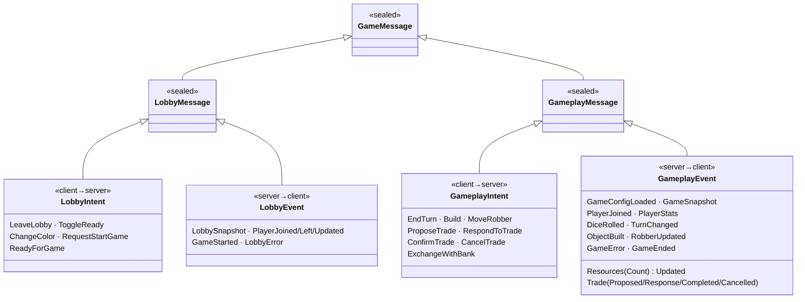

# Hexon Domain Model

Visual class-level overview of the Hexon server and the shared KMP module. Interfaces represent each capability; concrete implementations are noted but not detailed. Methods are grouped by intent to keep the diagrams readable.

---

## 1. Application Layer — Bootstrap & HTTP/WS Routing

```mermaid
classDiagram
    direction TB

    class Application {
        <<Ktor>>
        + module / configure*()
    }
    class AppModule {
        <<Koin DI>>
        + appModule() : Module
    }
    class DatabaseFactory {
        <<object>>
        + init(config)
        + dbQuery(block)
    }
    class Configs {
        <<data>>
        JwtConfig
        SmtpConfig
        CookieConfig
    }

    class AuthRoutes {
        <<REST>>
        /auth/register · /login
        /refresh · /logout
    }
    class UsersRoutes {
        <<REST>>
        /users/me · /id
        /email/* · /password/*
        /me/delete/*
    }
    class SocialRoutes {
        <<REST>>
        /friends · /requests
        /add · /respond
    }
    class MatchmakingRoutes {
        <<REST + WS>>
        POST /game · /lobby
        WS   /game/{sessionId}
    }

    Application --> AppModule : loads
    Application --> DatabaseFactory : initializes
    Application --> AuthRoutes
    Application --> UsersRoutes
    Application --> SocialRoutes
    Application --> MatchmakingRoutes
    AppModule --> Configs : provides
```

---

## 2. Authentication & User Account Domain



> Implementations: `JwtTokenService`, `ExposedAuthRepository`, and `*ServiceImpl` classes wired through Koin.

---

## 3. Email Verification, Profiles & Social Domain



---

## 4. Matchmaking & Game Session Domain



> Implementations: `MatchmakingServiceImpl`, `LobbyServiceImpl`, `InMemoryGameSessionRepository`, `GameEngineImpl`.

---

## 5. Shared — Game Configuration & Board Model



---

## 6. Shared — Player State & Turn Model



---

## 7. Shared — WebSocket Message Protocol



---

### Reading guide

- **Interfaces** describe every capability of the server. Concrete implementations (`*Impl`, `Exposed*`, `InMemory*`) are wired via Koin and follow a one-to-one mapping with their interface.
- **Solid arrows (→)** are *uses / depends on* relationships; **dashed-impl arrows (..|>)** denote interface implementation; **inheritance triangles (<|--)** denote sealed-class hierarchies.
- The shared module (sections 5–7) is consumed by both the server and the KMP clients, guaranteeing a single source of truth for game rules and the WebSocket protocol.
