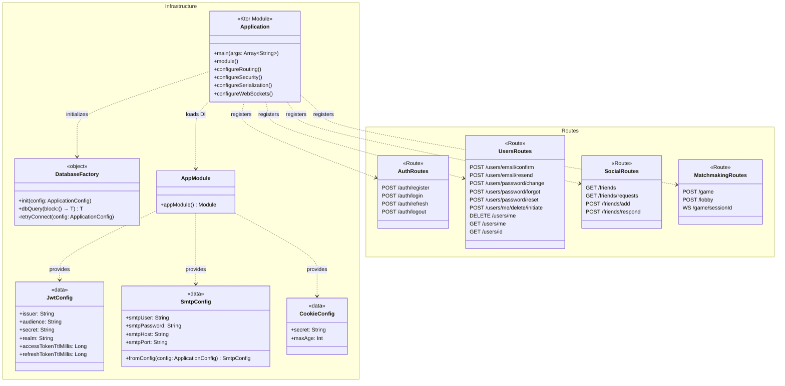
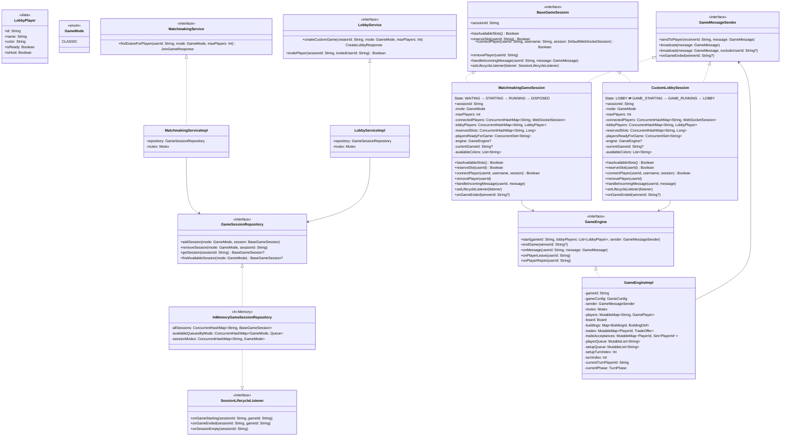
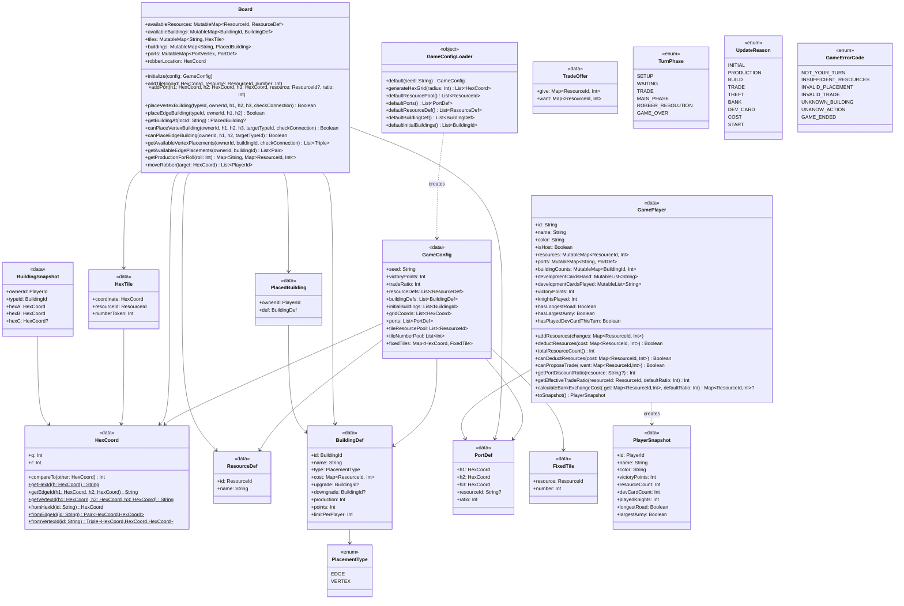

# Hexon Domain Model

Complete class-level reference for the server and shared KMP modules, organized by domain.

---

## 1. Infrastructure & Routing

---

## 2. Authentication Domain

```mermaid
classDiagram
    direction TB

    class User {
        <<data>>
        +id: String
        +email: String
        +username: String
        +password: String
        +isVerified: Boolean
    }

    class TokenService {
        <<interface>>
        +generateAccessToken(userId: String, username: String) String
        +generateRefreshToken(userId: String) String
        +validateRefreshToken(token: String) String?
    }

    class JwtTokenService {
        -config: JwtConfig
    }

    class AuthRepository {
        <<interface>>
        +isEmailRegistered(email: String) Boolean
        +isUsernameTaken(username: String) Boolean
        +createUser(email: String, username: String, passwordHash: String) User
        +findUserByEmail(email: String) User?
        +findUserById(userId: String) User?
        +findUserByUsername(username: String) User?
        +addRefreshToken(userId: String, hash: String, expiresAt: LocalDateTime)
        +updateRefreshToken(oldHash: String, newHash: String, expiresAt: LocalDateTime) Boolean
        +hasRefreshTokenHash(hash: String) Boolean
        +revokeRefreshToken(hash: String)
        +revokeAllRefreshTokens(userId: String)
        +clearExpiredSessions()
        +verifyUser(userId: String)
        +updatePassword(userId: String, newHash: String)
        +deleteUser(userId: String)
    }

    class ExposedAuthRepository {
        <<Exposed ORM>>
    }

    class LoginService {
        <<interface>>
        +login(request: LoginRequest) LoginResponse
    }

    class LoginServiceImpl {
        -authRepository: AuthRepository
        -tokenService: TokenService
    }

    class RegisterService {
        <<interface>>
        +register(request: RegisterRequest) RegisterResponse
    }

    class RegisterServiceImpl {
        -authRepository: AuthRepository
        -emailVerificationService: EmailVerificationService
    }

    class RefreshService {
        <<interface>>
        +refresh(request: RefreshRequest) RefreshResponse
    }

    class RefreshServiceImpl {
        -authRepository: AuthRepository
        -tokenService: TokenService
    }

    class LogoutService {
        <<interface>>
        +logout(request: LogoutRequest) LogoutResponse
    }

    class LogoutServiceImpl {
        -authRepository: AuthRepository
        -tokenService: TokenService
    }

    class EmailVerificationService {
        <<interface>>
        +sendVerificationCodeByEmail(email: String, type: EmailVerificationType)
        +sendVerificationCodeByUserId(userId: String, type: EmailVerificationType)
        +verifyCodeByEmail(email: String, code: String, type: EmailVerificationType) Boolean
        +verifyCodeByUserId(userId: String, code: String, type: EmailVerificationType) Boolean
    }

    class AccountVerificationService {
        <<interface>>
        +verifyEmail(request: VerifyEmailRequest) VerifyEmailResponse
        +resendVerificationCode(request: ResendVerificationCodeRequest) ResendVerificationCodeResponse
    }

    class AccountVerificationServiceImpl {
        -authRepository: AuthRepository
        -emailVerificationService: EmailVerificationService
        -tokenService: TokenService
        -profileRepository: ProfileRepository
    }

    class UserAccountService {
        <<interface>>
        +changePassword(userId: String, request: ChangePasswordRequest) ChangePasswordResponse
        +forgotPassword(request: ForgotPasswordRequest) ForgotPasswordResponse
        +resetPassword(request: ResetPasswordRequest) ResetPasswordResponse
        +requestAccountDeletion(userId: String) RequestDeleteAccountResponse
        +confirmAccountDeletion(userId: String, request: ConfirmDeleteAccountRequest) ConfirmDeleteAccountResponse
    }

    class UserAccountServiceImpl {
        -authRepository: AuthRepository
        -emailVerificationService: EmailVerificationService
    }

    TokenService <|.. JwtTokenService
    AuthRepository <|.. ExposedAuthRepository
    LoginService <|.. LoginServiceImpl
    RegisterService <|.. RegisterServiceImpl
    RefreshService <|.. RefreshServiceImpl
    LogoutService <|.. LogoutServiceImpl
    AccountVerificationService <|.. AccountVerificationServiceImpl
    UserAccountService <|.. UserAccountServiceImpl

    LoginServiceImpl --> AuthRepository
    LoginServiceImpl --> TokenService
    RegisterServiceImpl --> AuthRepository
    RegisterServiceImpl --> EmailVerificationService
    RefreshServiceImpl --> AuthRepository
    RefreshServiceImpl --> TokenService
    LogoutServiceImpl --> AuthRepository
    LogoutServiceImpl --> TokenService
    AccountVerificationServiceImpl --> AuthRepository
    AccountVerificationServiceImpl --> EmailVerificationService
    AccountVerificationServiceImpl --> TokenService
    UserAccountServiceImpl --> AuthRepository
    UserAccountServiceImpl --> EmailVerificationService
    AuthRepository ..> User : returns
```

---

## 3. Email, Profile & Social Domain

```mermaid
classDiagram
    direction TB

    class StoredVerificationCode {
        <<data>>
        +codeHash: String
        +type: EmailVerificationType
        +expiresAt: Instant
    }

    class EmailVerificationType {
        <<enum>>
        EMAIL_CONFIRMATION
        PASSWORD_RESET
        ACCOUNT_DELETION
    }

    class EmailVerificationRepository {
        <<interface>>
        +saveVerificationCode(email: String, hash: String, type: EmailVerificationType, expiresAt: Instant)
        +getVerificationCode(email: String) StoredVerificationCode?
        +incrementAttempts(email: String)
        +deleteVerificationCode(email: String)
        +deleteExpiredCodes()
    }

    class ExposedEmailVerificationRepository {
        <<Exposed ORM>>
    }

    class SmtpService {
        <<interface>>
        +sendEmail(to: String, subject: String, body: String)
    }

    class SmtpServiceImp {
        -smtpConfig: SmtpConfig
        -session: Session
    }

    class EmailVerificationServiceImpl {
        -verificationRepo: EmailVerificationRepository
        -smtpService: SmtpService
        -authRepository: AuthRepository
        -codeValidityDuration: Duration
        -bcryptCost: Int
        +sendVerificationCodeByEmail(email, type)
        +sendVerificationCodeByUserId(userId, type)
        +verifyCodeByEmail(email, code, type) Boolean
        +verifyCodeByUserId(userId, code, type) Boolean
    }

    class UserProfile {
        <<data>>
        +userId: String
        +email: String
        +username: String
        +gamesWon: Int
        +gamesLost: Int
    }

    class ProfileRepository {
        <<interface>>
        +createProfile(userId: String)
        +getUserProfile(userId: String) UserProfile?
        +updateStats(userId: String, isWin: Boolean)
    }

    class ExposedProfileRepository {
        <<Exposed ORM>>
    }

    class UserProfileService {
        <<interface>>
        +getMyProfile(userId: String) UserProfileResponse
        +getPublicProfile(userId: String) PublicUserProfileResponse?
    }

    class UserProfileServiceImpl {
        -profileRepository: ProfileRepository
    }

    class Friend {
        <<data>>
        +id: String
        +username: String
        +isOnline: Boolean
    }

    class FriendsRepository {
        <<interface>>
        +getFriendsForUser(userId: String) List~Friend~
        +areFriends(userId1: String, userId2: String) Boolean
        +addFriendship(userId1: String, userId2: String) Boolean
        +removeFriendship(userId1: String, userId2: String) Boolean
    }

    class ExposedFriendsRepository {
        <<Exposed ORM>>
    }

    class FriendRequestRepository {
        <<interface>>
        +hasPendingRequest(requesterId: String, receiverId: String) Boolean
        +getIncomingRequests(receiverId: String) List~Friend~
        +createRequest(requesterId: String, receiverId: String) Boolean
        +deleteRequest(requesterId: String, receiverId: String) Boolean
    }

    class ExposedFriendRequestRepository {
        <<Exposed ORM>>
    }

    class SocialService {
        <<interface>>
        +getFriends(userId: String) GetFriendsResponse
        +getFriendRequests(userId: String) GetFriendRequestsResponse
        +sendFriendRequest(requesterId: String, targetUsername: String) AddFriendResponse
        +respondToRequest(userId: String, requesterUsername: String, action: FriendRequestAction) RespondFriendResponse
    }

    class SocialServiceImpl {
        -friendsRepository: FriendsRepository
        -requestsRepository: FriendRequestRepository
        -authRepository: AuthRepository
    }

    EmailVerificationRepository <|.. ExposedEmailVerificationRepository
    EmailVerificationRepository ..> StoredVerificationCode : returns
    SmtpService <|.. SmtpServiceImp
    EmailVerificationServiceImpl --> EmailVerificationRepository
    EmailVerificationServiceImpl --> SmtpService
    ProfileRepository <|.. ExposedProfileRepository
    ProfileRepository ..> UserProfile : returns
    UserProfileService <|.. UserProfileServiceImpl
    UserProfileServiceImpl --> ProfileRepository
    FriendsRepository <|.. ExposedFriendsRepository
    FriendsRepository ..> Friend : returns
    FriendRequestRepository <|.. ExposedFriendRequestRepository
    FriendRequestRepository ..> Friend : returns
    SocialService <|.. SocialServiceImpl
    SocialServiceImpl --> FriendsRepository
    SocialServiceImpl --> FriendRequestRepository
```

---

## 4. Game Session Domain

---

## 5. Shared Game Logic

---

## 6. WebSocket Message Protocol

```mermaid
classDiagram
    direction TB

    class GameMessage {
        <<sealed>>
    }

    class LobbyMessage {
        <<sealed>>
    }

    class GameplayMessage {
        <<sealed>>
    }

    class LobbyIntent {
        <<sealed · client→server>>
    }

    class LobbyEvent {
        <<sealed · server→client>>
    }

    class GameplayIntent {
        <<sealed · client→server>>
    }

    class GameplayEvent {
        <<sealed · server→client>>
    }

    class LeaveLobby { <<object>> }
    class RequestStartGame { <<object>> }
    class ReadyForGame { <<object>> }
    class ToggleReady { +isReady: Boolean }
    class ChangeColor { +newColor: String }

    class LobbySnapshot {
        +lobbyId: String
        +lobbyPlayers: List~LobbyPlayer~
        +maxPlayers: Int
        +availableColors: List~String~
    }
    class LobbyPlayerJoined { +lobbyPlayer: LobbyPlayer }
    class LobbyPlayerLeft { +playerId: String }
    class LobbyPlayerUpdated { +lobbyPlayer: LobbyPlayer }
    class GameStarted { <<object>> }
    class LobbyError {
        +errorMessage: String
        +code: LobbyErrorCode
    }

    class EndTurn { <<object>> }
    class Build {
        +buildingId: BuildingId
        +h1: HexCoord
        +h2: HexCoord
        +h3: HexCoord?
    }
    class MoveRobber { +hexA: HexCoord }
    class ProposeTrade {
        +give: Map~ResourceId, Int~
        +want: Map~ResourceId, Int~
    }
    class RespondToTrade {
        +offererId: PlayerId
        +accepted: Boolean
    }
    class ConfirmTrade { +responderId: PlayerId }
    class CancelTrade { +offererId: PlayerId }
    class ExchangeWithBank {
        +give: Map~ResourceId, Int~
        +get: Map~ResourceId, Int~
    }

    class GameConfigLoaded { +config: GameConfig }
    class GamePlayerStats { +player: GamePlayer }
    class GameSnapshot {
        +boardState: List~BuildingSnapshot~
        +players: List~PlayerSnapshot~
        +currentTurnPlayerId: String
        +diceResult: List~Int~?
        +robberLocation: HexCoord?
    }
    class GameplayPlayerJoined { +player: PlayerSnapshot }
    class RobberUpdated { +location: HexCoord }
    class ResourcesUpdated {
        +changes: Map~ResourceId, Int~
        +reason: UpdateReason
    }
    class ResourceCountUpdated {
        +playerId: PlayerId
        +changes: Int
        +reason: UpdateReason
    }
    class ObjectBuilt {
        +playerId: PlayerId
        +buildingId: BuildingId
        +hexA: HexCoord
        +hexB: HexCoord
        +hexC: HexCoord?
    }
    class DiceRolled { +values: Pair~Int, Int~ }
    class TurnChanged {
        +turnPhase: TurnPhase
        +newPlayerId: PlayerId
    }
    class TradeProposed {
        +give: Map~ResourceId, Int~
        +want: Map~ResourceId, Int~
        +offererId: PlayerId
    }
    class TradeResponse {
        +offererId: PlayerId
        +responderId: PlayerId
        +accepted: Boolean
    }
    class TradeCompleted {
        +responderId: PlayerId
        +offererId: PlayerId
    }
    class TradeCancelled { +offererId: PlayerId }
    class GameError {
        +message: String
        +code: GameErrorCode
    }
    class GameEnded {
        +winnerId: String?
        +gameId: String
    }

    GameMessage <|-- LobbyMessage
    GameMessage <|-- GameplayMessage
    LobbyMessage <|-- LobbyIntent
    LobbyMessage <|-- LobbyEvent
    GameplayMessage <|-- GameplayIntent
    GameplayMessage <|-- GameplayEvent

    LobbyIntent <|-- LeaveLobby
    LobbyIntent <|-- ToggleReady
    LobbyIntent <|-- ChangeColor
    LobbyIntent <|-- RequestStartGame
    LobbyIntent <|-- ReadyForGame

    LobbyEvent <|-- LobbySnapshot
    LobbyEvent <|-- LobbyPlayerJoined
    LobbyEvent <|-- LobbyPlayerLeft
    LobbyEvent <|-- LobbyPlayerUpdated
    LobbyEvent <|-- GameStarted
    LobbyEvent <|-- LobbyError

    GameplayIntent <|-- EndTurn
    GameplayIntent <|-- Build
    GameplayIntent <|-- MoveRobber
    GameplayIntent <|-- ProposeTrade
    GameplayIntent <|-- RespondToTrade
    GameplayIntent <|-- ConfirmTrade
    GameplayIntent <|-- CancelTrade
    GameplayIntent <|-- ExchangeWithBank

    GameplayEvent <|-- GameConfigLoaded
    GameplayEvent <|-- GameplayPlayerJoined
    GameplayEvent <|-- GamePlayerStats
    GameplayEvent <|-- GameSnapshot
    GameplayEvent <|-- RobberUpdated
    GameplayEvent <|-- ResourcesUpdated
    GameplayEvent <|-- ResourceCountUpdated
    GameplayEvent <|-- ObjectBuilt
    GameplayEvent <|-- DiceRolled
    GameplayEvent <|-- TurnChanged
    GameplayEvent <|-- TradeProposed
    GameplayEvent <|-- TradeResponse
    GameplayEvent <|-- TradeCompleted
    GameplayEvent <|-- TradeCancelled
    GameplayEvent <|-- GameError
    GameplayEvent <|-- GameEnded
```

