# Hexon Domain Model (Compact)

High-level overview of the server architecture and shared game logic. For detailed method signatures, see [SINGLE_DOMAIN_MODEL.md](file:///Users/eric/StudioProjects/HexonKMP/SINGLE_DOMAIN_MODEL.md).

```mermaid
classDiagram
    direction TB

    %% ── Identity & Access ──────────────────────────────────────────────────
    namespace Identity {
        class AuthRoutes { <<Route>> register, login, refresh, profile }
        class AuthService { <<Interface>> handle login, registration, tokens }
        class AccountService { <<Interface>> passwords, verification, deletion }
        class AuthRepository { <<Interface>> CRUD for Users and Sessions }
        class User { id, email, username, isVerified }
    }

    %% ── Social Layer ────────────────────────────────────────────────────────
    namespace Social {
        class SocialRoutes { <<Route>> friends, requests }
        class SocialService { <<Interface>> manage friendship & requests }
        class UserProfileService { <<Interface>> get public/private stats }
        class FriendsRepo { <<Interface>> friendship persistence }
        class UserProfile { userId, username, stats }
    }

    %% ── Game Infrastructure ─────────────────────────────────────────────────
    namespace Matchmaking {
        class MatchmakingService { <<Interface>> find/queue classic games }
        class LobbyService { <<Interface>> create/manage custom lobbies }
        class SessionRepository { <<Interface>> manage active game sessions }
    }

    %% ── Game Loop ───────────────────────────────────────────────────────────
    namespace Gaming {
        class WebSocketHandler { <<WS>> sync game state & intents }
        class BaseGameSession { <<Interface>> player lifecycle, message routing }
        class GameEngine { <<Interface>> turn logic, rule enforcement }
        class GameMessageSender { <<Interface>> broadcast state updates }
    }

    %% ── Core Game Logic ─────────────────────────────────────────────────────
    namespace SharedLogic {
        class Board { tiles, buildings, ports, robber }
        class GamePlayer { id, color, resources, victoryPoints }
        class HexCoord { q, r, geometry helpers }
        class GameConfig { map layout, resource pools, rules }
        class Defs { resourceDef, buildingDef, portDef }
    }

    %% ── Connectivity & Messaging ────────────────────────────────────────────
    namespace Messaging {
        class ClientIntent { <<Sealed>> Build, Trade, Roll, EndTurn, Chat }
        class ServerEvent { <<Sealed>> Snapshot, Update, Roll, TurnChange, End }
    }

    %% ── Core Flow ───────────────────────────────────────────────────────────
    AuthRoutes ..> AuthService
    AuthService ..> AuthRepository
    AuthRepository ..> User

    SocialRoutes ..> SocialService
    SocialService ..> FriendsRepo
    SocialService ..> AuthRepository

    MatchmakingService ..> SessionRepository
    SessionRepository ..> BaseGameSession
    
    BaseGameSession *-- GameEngine
    GameEngine o-- Board
    GameEngine o-- GamePlayer
    GameEngine --> GameMessageSender
    
    Board *-- HexCoord
    Board *-- Defs
    GameEngine --> GameConfig
    
    WebSocketHandler ..> ClientIntent : receives
    WebSocketHandler ..> ServerEvent : sends
```

## Key Architectural Patterns

- **Separation of Concerns**: Routes handle HTTP/WS logic, Services handle business logic, and Repositories handle persistence (Exposed ORM or In-Memory).
- **In-Memory Game State**: Active game sessions are stored in memory (`SessionRepository`) rather than a database for performance.
- **Sealed Messaging**: All communication via WebSockets uses sealed class hierarchies (`ClientIntent` and `ServerEvent`) to ensure type safety across KMP.
- **Stateless Domain Logic**: The `Board` and `GameEngine` operate on pure data structures where possible, making the logic testable and portable between server and client.
