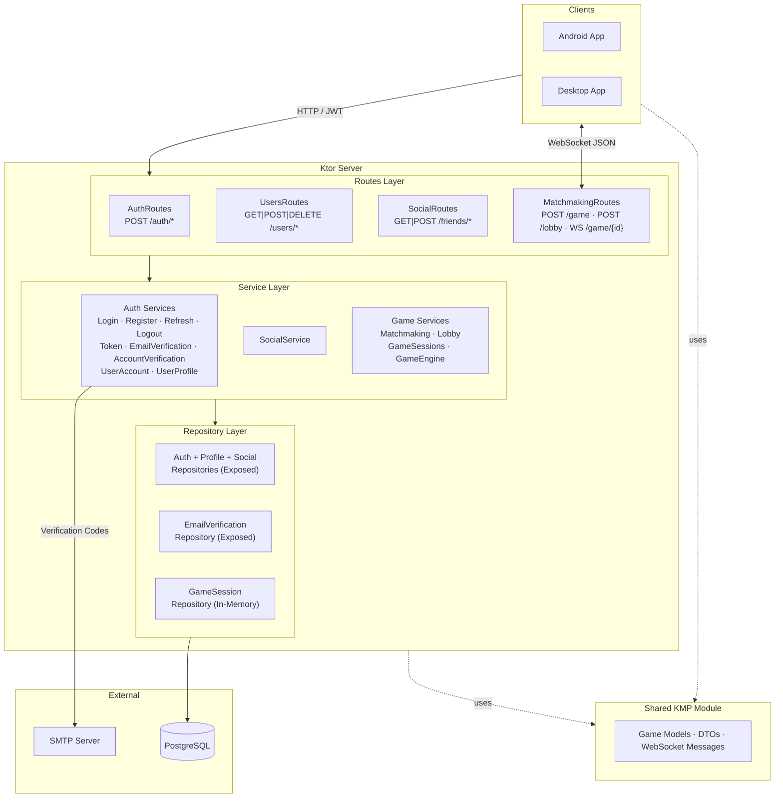
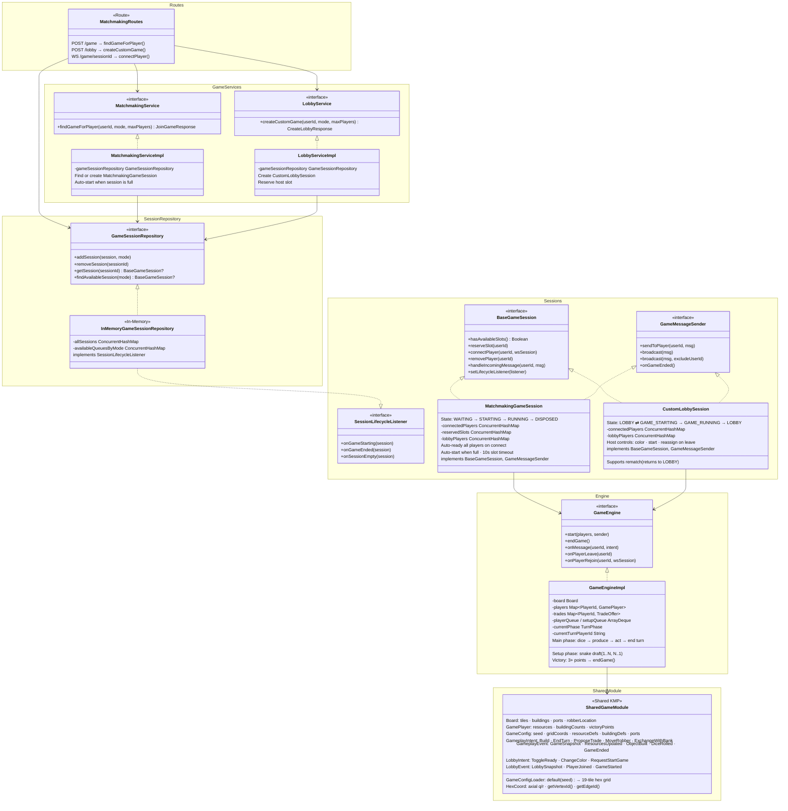
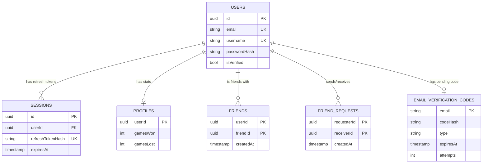
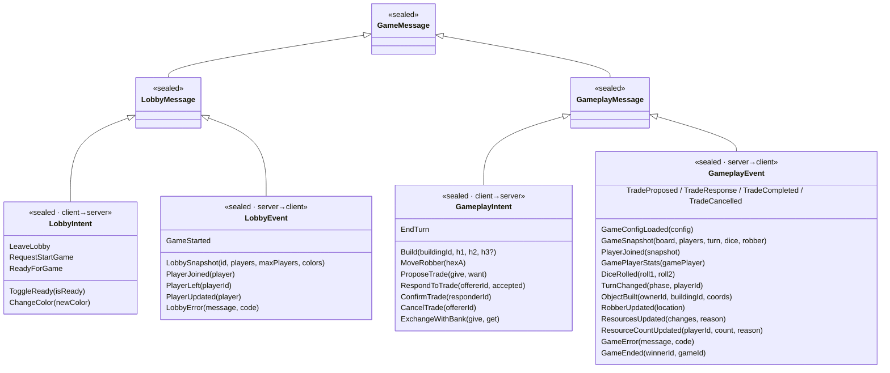
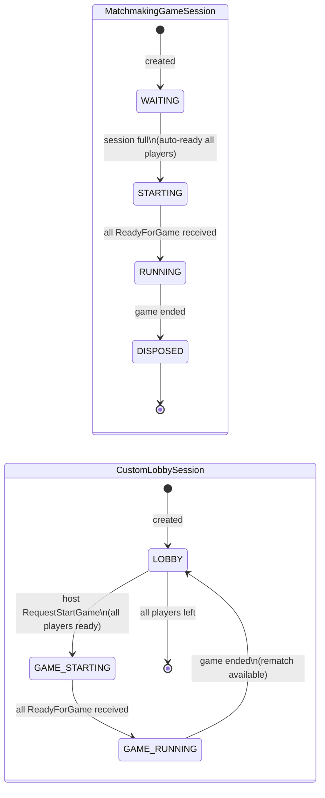

# Hexon Server Architecture

A **Kotlin Multiplatform** game server built with **Ktor** (HTTP + WebSocket), **Koin** (DI), **Jetbrains Exposed** (ORM), and **PostgreSQL**.

---

## System Overview



---

## Auth & User Domain

```mermaid
classDiagram
    direction TB

    namespace Routes {
        class AuthRoutes {
            <<Route>>
            POST /auth/register
            POST /auth/login
            POST /auth/refresh
            POST /auth/logout
        }
        class UsersRoutes {
            <<Route>>
            POST /users/email/confirm|resend
            POST /users/password/change|forgot|reset
            POST /users/me/delete/initiate
            DELETE /users/me
            GET /users/me
            GET /users/id
        }
        class SocialRoutes {
            <<Route>>
            GET /friends
            GET /friends/requests
            POST /friends/add
            POST /friends/respond
        }
    }

    namespace AuthServices {
        class LoginService {
            <<interface>>
            +login(req) LoginResponse
        }
        class RegisterService {
            <<interface>>
            +register(req) RegisterResponse
        }
        class RefreshService {
            <<interface>>
            +refresh(req) RefreshResponse
        }
        class LogoutService {
            <<interface>>
            +logout(req) LogoutResponse
        }
        class TokenService {
            <<interface>>
            +generateAccessToken(userId, username) String
            +generateRefreshToken(userId) String
            +validateRefreshToken(token) String?
        }
        class AccountVerificationService {
            <<interface>>
            +verifyEmail(req) VerifyEmailResponse
            +resendVerificationCode(req)
        }
        class UserAccountService {
            <<interface>>
            +changePassword(userId, req)
            +forgotPassword(req)
            +resetPassword(req)
            +requestAccountDeletion(userId)
            +confirmAccountDeletion(userId, req)
        }
        class EmailVerificationService {
            <<interface>>
            +sendVerificationCode(email, type)
            +verifyCode(email, code, type) Boolean
        }
        class SmtpService {
            <<interface>>
            +sendEmail(to, subject, body)
        }
    }

    namespace UserServices {
        class UserProfileService {
            <<interface>>
            +getMyProfile(userId) UserProfileResponse
            +getPublicProfile(userId) PublicUserProfileResponse
        }
        class SocialService {
            <<interface>>
            +getFriends(userId) List~FriendDto~
            +getFriendRequests(userId) List~FriendDto~
            +sendFriendRequest(userId, target)
            +respondToRequest(userId, requester, action)
        }
    }

    namespace Repositories {
        class AuthRepository {
            <<interface>>
            +createUser() / findUserBy*()
            +addRefreshToken() / revokeRefreshToken()
            +revokeAllRefreshTokens() / hasRefreshTokenHash()
            +verifyUser() / updatePassword() / deleteUser()
        }
        class ProfileRepository {
            <<interface>>
            +createProfile(userId)
            +getUserProfile(userId) UserProfile
            +updateStats(userId, won)
        }
        class FriendsRepository {
            <<interface>>
            +getFriends(userId) List~Friend~
            +addFriendship(a, b) / removeFriendship(a, b)
            +areFriends(a, b) Boolean
        }
        class FriendRequestRepository {
            <<interface>>
            +createRequest(from, to)
            +deleteRequest(from, to)
            +getIncomingRequests(userId) List~Friend~
            +hasPendingRequest(a, b) Boolean
        }
        class EmailVerificationRepository {
            <<interface>>
            +saveVerificationCode(email, hash, type)
            +getVerificationCode(email) StoredVerificationCode?
            +deleteVerificationCode(email)
            +deleteExpiredCodes()
        }
    }

    namespace Database {
        class DatabaseTables {
            <<Exposed DSL>>
            Users: id · email · username · passwordHash · isVerified
            Sessions: userId · refreshTokenHash · expiresAt
            Profiles: userId · gamesWon · gamesLost
            Friends: userId · friendId
            FriendRequests: requesterId · receiverId
            EmailVerificationCodes: email · codeHash · type · expiresAt · attempts
        }
    }

    AuthRoutes --> LoginService
    AuthRoutes --> RegisterService
    AuthRoutes --> RefreshService
    AuthRoutes --> LogoutService

    UsersRoutes --> AccountVerificationService
    UsersRoutes --> UserAccountService
    UsersRoutes --> UserProfileService

    SocialRoutes --> SocialService

    LoginService --> AuthRepository
    LoginService --> TokenService
    RegisterService --> AuthRepository
    RegisterService --> EmailVerificationService
    RefreshService --> AuthRepository
    RefreshService --> TokenService
    LogoutService --> AuthRepository
    LogoutService --> TokenService

    AccountVerificationService --> AuthRepository
    AccountVerificationService --> EmailVerificationService
    AccountVerificationService --> TokenService
    AccountVerificationService --> ProfileRepository

    UserAccountService --> AuthRepository
    UserAccountService --> EmailVerificationService

    EmailVerificationService --> EmailVerificationRepository
    EmailVerificationService --> SmtpService
    EmailVerificationService --> AuthRepository

    UserProfileService --> ProfileRepository
    SocialService --> AuthRepository
    SocialService --> FriendsRepository
    SocialService --> FriendRequestRepository

    AuthRepository <|.. ExposedAuthRepository
    ProfileRepository <|.. ExposedProfileRepository
    FriendsRepository <|.. ExposedFriendsRepository
    FriendRequestRepository <|.. ExposedFriendRequestRepository
    EmailVerificationRepository <|.. ExposedEmailVerificationRepository

    ExposedAuthRepository --> DatabaseTables
    ExposedProfileRepository --> DatabaseTables
    ExposedFriendsRepository --> DatabaseTables
    ExposedFriendRequestRepository --> DatabaseTables
    ExposedEmailVerificationRepository --> DatabaseTables
```



---

## Game Domain



---

## Database Schema



---

## WebSocket Protocol



---

## Session State Machines



---

## Key Flows

### Registration & Email Verification
```
POST /auth/register → RegisterServiceImpl
  → validate email/username/password
  → BCrypt hash password (cost 12)
  → AuthRepository.createUser() (isVerified = false)
  → EmailVerificationService.sendCode(email, EMAIL_CONFIRMATION)
      → generate 6-digit code → BCrypt hash (cost 10) → store (15 min TTL)
      → SmtpService.sendEmail()

POST /users/email/confirm → AccountVerificationServiceImpl
  → EmailVerificationService.verifyCode()
  → AuthRepository.verifyUser()
  → ProfileRepository.createProfile()
  → TokenService.generateAccessToken() + generateRefreshToken()
  → AuthRepository.addRefreshToken(hash)
  → Return access + refresh tokens
```

### Token Lifecycle (Rotation)
```
POST /auth/refresh → RefreshServiceImpl
  → TokenService.validateRefreshToken() (signature + expiry)
  → AuthRepository.hasRefreshTokenHash() (revocation check)
  → Generate new access token + new refresh token
  → AuthRepository.updateRefreshToken() (replace old hash)
  → Return new token pair
```

### Game Matchmaking → Gameplay
```
POST /game → MatchmakingServiceImpl
  → GameSessionRepository.findAvailableSession(CLASSIC)
  → If none: create MatchmakingGameSession → addSession()
  → session.reserveSlot(userId) → return sessionId

WS /game/{sessionId} → MatchmakingRoutes
  → JWT auth → getSession(sessionId)
  → session.connectPlayer(userId, wsSession)
  → [session auto-starts when full]
  → GameEngine.start() → broadcast GameConfigLoaded + GameSnapshot
  → Message loop: deserialize → session.handleIncomingMessage()
      → LobbyIntent → session lobby logic
      → GameplayIntent → GameEngineImpl.onMessage()
  → Player disconnect: session.removePlayer()
```
