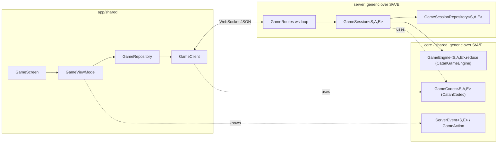
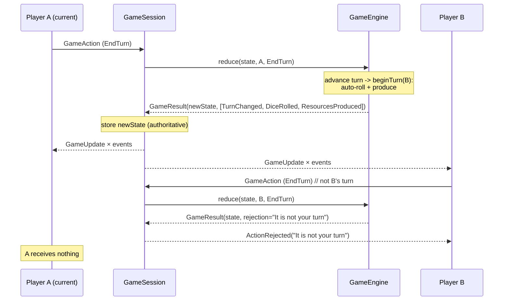
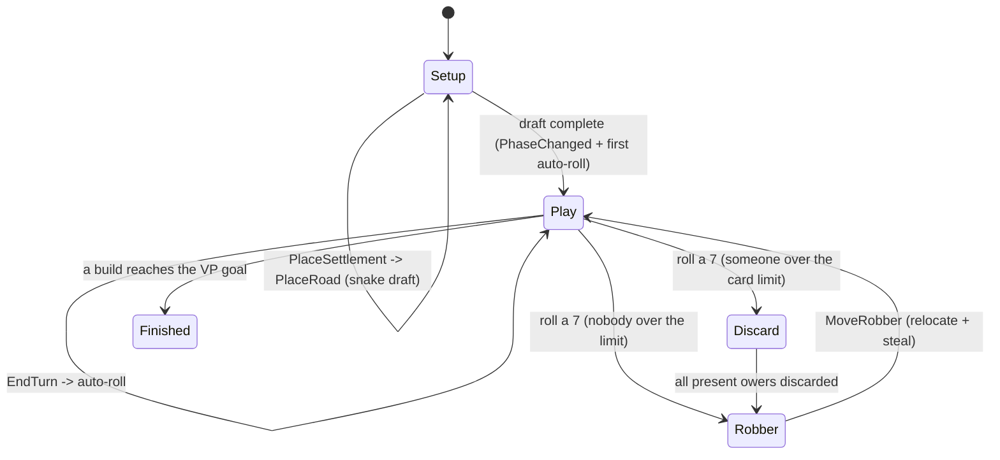
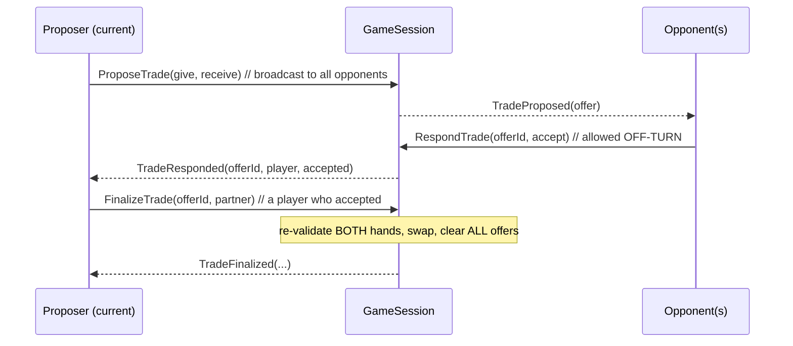
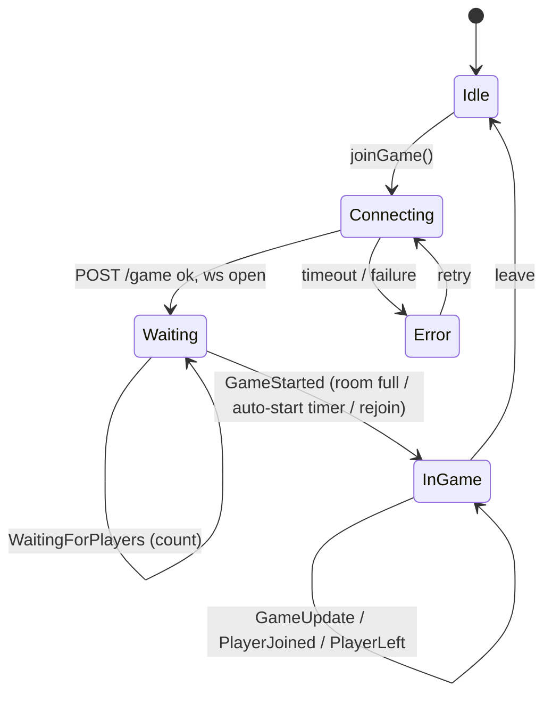
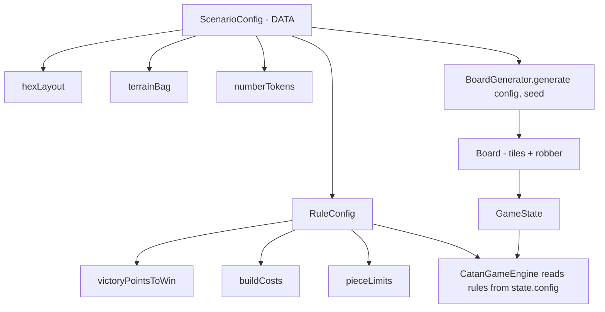

# HexonKMP Architecture

A multiplayer Catan built with Kotlin Multiplatform. This document explains how
the pieces fit together so the game logic can grow without touching networking.

## Guiding principle: separate *transport* from *game logic*

The system is split into two worlds that never leak into each other:

- **Transport / connection layer** — who is connected, sending and receiving
  bytes, matchmaking, reconnects. Lives in the **server** module and the client
  **data layer**. It knows nothing about Catan rules.
- **Game layer** — a *pure* engine that, given a state and an action, produces a
  new state and a list of events. Lives in **`core`** and is shared by both
  client and server. It knows nothing about sockets or coroutines.

The seam between them is one function:

```kotlin
fun reduce(state: GameState, actor: PlayerId, action: GameAction): GameResult
```

Everything Catan lives behind `reduce`. Everything network lives in front of it.

### The transport is generic over the game

The separation is enforced by types, not just convention: the **entire transport
stack is generic over a game's State `S`, Action `A`, and Event `E`**. The server
session, matchmaking, protocol envelope, and codec name only `S/A/E` — never
Catan. Catan is one *wiring* of these generics, assembled in the server's DI.

```kotlin
interface GameEngine<S, A, E> {                 // transport-facing, game-agnostic
    fun initialState(players: List<PlayerId>): S
    fun reduce(state: S, actor: PlayerId, action: A): GameResult<S, E>
    fun playerLeft(state: S, playerId: PlayerId): GameResult<S, E>
    fun playerJoined(state: S, playerId: PlayerId): GameResult<S, E>
}

// Catan binds the generics and adds the legal-move queries the client UI uses:
interface CatanEngine : GameEngine<GameState, GameAction, GameEvent> {
    fun legalSettlements(state: GameState, player: PlayerId): Set<Vertex>
    fun legalRoads(state: GameState, player: PlayerId): Set<Edge>
    fun legalCities(state: GameState, player: PlayerId): Set<Vertex>
    fun canAfford(state: GameState, player: PlayerId, buildable: Buildable): Boolean
}
class CatanGameEngine(config: ScenarioConfig = ClassicCatan, …) : CatanEngine
```

The generic contracts each live in their own file (`engine/GameEngine.kt`,
`engine/GameResult.kt`, `model/Redactable.kt`, `protocol/GameCodec.kt`,
`protocol/ServerEvent.kt`) — they are *the main architecture*. The Catan
implementations (`CatanEngine`, `CatanGameEngine`, `CatanCodec`) are separate.
To host a different game you provide a new engine + codec and reuse everything
else; see *Hosting another game* below.

## Modules

```
core/        Shared KMP module — pure types + game engine + wire protocol.
             No server deps, no UI. Runs on every platform.
server/      Ktor (Netty) server. Owns connections + the authoritative state.
app/shared/  Compose Multiplatform client (Android, iOS, JVM, JS).
app/*App/    Thin per-platform launchers.
```

### Why the engine lives in `core` (shared)

Because both sides can run the same rules:

- **Server** runs `reduce` as the *source of truth*.
- **Client** can run the same `reduce` to pre-validate a move before sending it
  (instant feedback, optimistic UI) — using the exact same code, so they can
  never disagree about the rules.

## High-level flow



The client and server only ever exchange JSON-encoded `GameAction` (client →
server) and `ServerEvent` (server → client). `GameCodec` is the single
(de)serialization seam (Catan's impl is `CatanCodec`); the server's `GameRoutes`
loop just forwards raw frames — `GameSession` decodes them via its codec, so the
route layer is fully game-agnostic.

## The two message sets

### `GameAction` (client → server) — `core/game/action/`
Player intents. The only thing a client can *do*.

```kotlin
sealed interface GameAction
data object EndTurn : GameAction
data class PlaceSettlement(val vertex: Vertex) : GameAction   // setup placement or play-phase build
data class PlaceRoad(val edge: Edge) : GameAction
data class UpgradeCity(val vertex: Vertex) : GameAction       // settlement -> city
data class MoveRobber(val hex: Axial) : GameAction           // after a 7
data class DiscardResources(val cards: ResourceCount) : GameAction  // 7 discard penalty
// (no action ends the game — the engine ends it when a build reaches the VP goal)
data class BankTrade(val swaps: List<BankSwap>) : GameAction  // atomic ratio:1 swaps with the bank
// Player-to-player trades:
data class ProposeTrade(val give: ResourceCount, val receive: ResourceCount) : GameAction
data class RespondTrade(val offerId: Int, val accept: Boolean) : GameAction
data class FinalizeTrade(val offerId: Int, val partner: PlayerId) : GameAction
data class CancelTrade(val offerId: Int) : GameAction          // proposer withdraws one offer
```

### `ServerEvent<S, E>` (server → client) — `core/protocol/`
The transport envelope, **generic over the game** (`out S, out E`). Declaration-
site variance lets the agnostic lifecycle messages be `ServerEvent<Nothing,
Nothing>` so they carry no phantom type params; only the two payload-carrying
variants are game-specific (`GameStarted<out S>`, `GameUpdate<out E>`). Split by
phase:

| Phase        | Events                                              |
|--------------|-----------------------------------------------------|
| Lobby        | `WaitingForPlayers(connected, needed)`, `GameStarted(state: S)` |
| Presence     | `PlayerJoined(playerId)`, `PlayerLeft(playerId)`    |
| Game updates | `GameUpdate(event: E)` wrapping a `GameEvent`, `ActionRejected(reason)` |
| Client-local | `ConnectionFailed(reason)` (never sent over the wire)|

The snapshot in `GameStarted` and each `GameUpdate` are shipped **per recipient,
redacted** — see *Hidden information* below.

`GameAction` variants so far: `EndTurn`, `PlaceSettlement(vertex)`,
`PlaceRoad(edge)`, `UpgradeCity(vertex)`, `MoveRobber(hex)`,
`DiscardResources(cards)`, `BankTrade(swaps)`, and the player-trade actions
`ProposeTrade` / `RespondTrade` / `FinalizeTrade` / `CancelTrade`.

### `GameEvent` (engine output) — `core/game/event/`
Pure domain deltas the engine emits. They describe *what changed* and have no
transport knowledge — the server wraps each one in a `GameUpdate` before sending.

```kotlin
sealed interface GameEvent
data class TurnChanged(val currentPlayer: PlayerId, val turn: Int) : GameEvent
data class DiceRolled(val die1: Int, val die2: Int, val total: Int) : GameEvent
data class ResourcesProduced(val gains: Map<PlayerId, ResourceCount>) : GameEvent
data class PhaseChanged(val phase: GamePhase) : GameEvent
data class BuildingPlaced(val building: Building) : GameEvent
data class RoadPlaced(val road: Road) : GameEvent
data class CityUpgraded(val building: Building) : GameEvent   // the resulting city
data class RobberMoved(val hex: Axial) : GameEvent
data class ResourceStolen(val from: PlayerId, val by: PlayerId, val resource: Resource?) : GameEvent  // resource null when redacted (hidden from third parties)
data class ResourcesDiscarded(val player: PlayerId, val cards: ResourceCount) : GameEvent
data class GameEnded(val winner: PlayerId) : GameEvent
data class BankTraded(val player: PlayerId, val given: ResourceCount, val received: ResourceCount) : GameEvent
// Player-to-player trades:
data class TradeProposed(val offer: TradeOffer) : GameEvent
data class TradeResponded(val offerId: Int, val player: PlayerId, val accepted: Boolean) : GameEvent
data class TradeFinalized(/* proposer/partner + the give/receive that swapped */) : GameEvent
data object TradeOffersCleared : GameEvent    // the proposer's turn ended
data class TradeCancelled(val offerId: Int) : GameEvent  // proposer withdrew one offer
```

> **Why three types instead of one?** `GameAction` is what players request,
> `GameEvent` is what actually happened (engine-authored, trustworthy), and
> `ServerEvent` is the transport wrapper that also carries non-game lifecycle
> messages. Keeping them separate means game rules never depend on networking.

## The engine (pure, testable) — `core/game/engine/`

The engine contract is the generic `GameEngine<S, A, E>` shown earlier; Catan
implements it via `CatanEngine` (`CatanGameEngine`). The result is generic too:

```kotlin
data class GameResult<out S, out E>(
    val state: S,                 // new state (== old if rejected)
    val events: List<E> = [],     // what to broadcast on success
    val rejection: String? = null, // why it failed (sent only to the actor)
)
// CatanGameEngine uses a private alias: typealias CatanResult = GameResult<GameState, GameEvent>
```

`reduce` is a **pure function**: no I/O, no shared mutable state, deterministic.
That makes the entire rulebook unit-testable without a server or a socket.

### Automatic actions: the dice roll

Some things happen *to* the game rather than being requested by a player. The
dice roll is the first: this is a digital game optimized for speed, so there is
**no manual "roll" step** — ending your turn atomically hands the turn to the
next player, rolls for them, and distributes resources.

This is modeled as an **engine-internal turn-begin step, not a `GameAction`**:

- A client can never roll its own dice (it would be trivially cheatable), so the
  roll is **server-authoritative** — `GameAction` stays just `EndTurn`.
- `beginTurn` runs at game start (for player 0) and after every turn handoff. It
  emits `DiceRolled` + `ResourcesProduced`, which ride along on the same
  `GameResult` as `TurnChanged`.
- **Randomness stays pure** via `GameState.rngSeed`: each roll seeds a `Random`
  from it and stores the advanced seed back, so `reduce` is still deterministic
  given a state (testable) while dice are effectively random across turns.

Resource production: each `Building` on a vertex touching a tile whose `token`
matches the roll collects that tile's resource (settlement ×1, city ×2) — except
the tile the **robber** sits on, which produces for nobody. A roll of 7 produces
nothing and instead hands the current player the robber (see below). All of this
reads from `state` + `state.config` — no hardcoded numbers.

### The robber (a roll of 7)

A 7 doesn't produce. It runs in two ordered, global steps before the turn
continues:

1. **Discard** (`GamePhase.Discard(pending)`) — every player holding more than
   `RuleConfig.robberDiscardThreshold` (7) cards must discard half (floor), via
   `DiscardResources(cards)` (allowed off-turn, like trade responses). The phase
   waits only on **present** players; a player who disconnects mid-discard has
   their owed cards auto-discarded at random (seeded) so they still pay and the
   phase never stalls. Skipped entirely if nobody is over the limit.
2. **Robber** (`GamePhase.Robber`) — the roller picks a new tile
   (`MoveRobber(hex)`, must differ from the current robber tile); the engine
   relocates the robber and **auto-steals** one random card from a random
   opponent with a building on that tile (the roller is excluded; no-op if none
   qualify or all are empty-handed), then returns to `Play`.

So a player who both owes a discard and is robbed discards first (step 1), then
may lose one more random card to the robber (step 2, off the post-discard hand).
Building/trading/ending the turn all gate on `Play`, so they're blocked through
both steps. Events: `ResourcesDiscarded`, `RobberMoved`, `ResourceStolen`. The
robbed tile produces for nobody while occupied. The client renders the robber as
a cylinder, shows a forced discard sheet while you owe, and makes tiles tappable
during the Robber phase.

> The same pattern fits future automatic effects (e.g. a turn timer auto-ending
> a turn): drive them through the engine as state transitions that emit events,
> never as trusted client actions.



### Game phases & the setup draft — `core/game/model/GamePhase`

The game runs through phases, held in `GameState.phase` and authoritative on the
server:



- **`Setup`** is the classic snake draft: each player places a settlement then a
  road, in order then reverse (e.g. 3 players: `0,1,2,2,1,0`). The phase carries
  the precomputed `order`, the current `index`, which piece is `awaiting`, and
  the `lastSettlement` the next road must touch. There is **no dice roll during
  setup**. A settlement placed in the *second* round grants its adjacent tiles'
  resources as a starting hand.
- **`Play`** begins automatically when the draft finishes (`PhaseChanged(Play)`),
  and the first player's turn opens with the usual auto-roll.
- **Leavers during setup don't stall or get skipped.** If a player leaves mid-
  draft, the engine auto-places a random *legal* settlement + road for them
  (granting second-round resources) — both for the current leaver and for any
  already-left player when their draft slot comes up. Invariant: the draft only
  ever comes to rest on a *present* player (or transitions to `Play`), so a leaver
  can never hold setup state hostage.

**Full placement validation lives in the engine:**
- Settlement (setup): the vertex must be empty *and* the distance rule holds (no
  building on any adjacent vertex).
- Road (setup): the edge must be empty *and* touch the settlement just placed.
- Settlement (play): the above, **plus** it must touch one of your own roads, and
  you must afford `RuleConfig.cost(SETTLEMENT)` (deducted on success).
- City (play): upgrade your own settlement (`UpgradeCity(vertex)`) — must be a
  settlement you own, costs `cost(CITY)`, replaces it in place (city yields ×2).
- Road (play): empty edge connected to your network, and you must afford
  `cost(ROAD)`. **Connectivity is per-endpoint**: a road extends your network from
  an endpoint vertex only if that vertex isn't occupied by *another player's*
  building — you can't run a road through an opponent's settlement/city, even if
  your own road reaches the far side.

Play-phase builds cost resources; the engine `spend`s them and the client mirrors
the deduction when it applies `BuildingPlaced` / `RoadPlaced` during `Play`.

**Legal-move queries.** The engine also exposes pure
`legalSettlements(state, player)` / `legalRoads(state, player)`. The server uses
them implicitly (validation), and the **client reuses the very same engine** to
offer only valid placements — the canonical example of the shared-engine payoff.
These are also what a rendered board will use to highlight tappable spots.

### Trading

Two trade kinds, both Play-phase only and both re-validated server-side.

**Bank trades** (`BankTrade`). A bundle of `BankSwap(give, get)`, each one
`ratio` of a resource for 1 of another (`RuleConfig.bankTradeRatio`, classic
4:1). Applied **atomically**: the engine sums every swap's gives/gets, validates
the hand covers the total once, and applies all-or-nothing — emitting a single
`BankTraded`. A swap *list* (not a pooled `ResourceCount`) is the natural shape
because you can't pool different resources toward one swap.

**Player-to-player trades** (`ProposeTrade` → `RespondTrade` → `FinalizeTrade`).
This is the first feature with **pending cross-player state**:
`GameState.pendingTrades: List<TradeOffer>` (with a monotonic `tradeCounter` for
unique ids). Flow:



- **Broadcast, not targeted**: one offer is visible to every opponent; any may
  accept/decline.
- **`RespondTrade` is the one action a non-current player may take.** It is
  dispatched in `reduce` *before* the `actor != currentPlayer` guard; every other
  action still requires it to be your turn.
- **Anti-cheat = re-validate at both ends.** Propose checks the proposer covers
  `give`; accept checks the responder covers `receive`; **finalize re-checks both
  hands** (and that the partner is present and actually accepted), because hands
  can change between proposing and finalizing.
- **Finalize clears all offers**; the proposer re-proposes if they want more.
  Offers also clear on any turn change (`TradeOffersCleared`), so they live only
  for the proposer's turn. The proposer can also withdraw a single offer with
  `CancelTrade` (`TradeCancelled`).

## Hidden information (per-recipient redaction)

Some state is secret: a player's **dev-card types**, their exact **resource
hand**, the **dev-card deck order**, and the **type of a card stolen by the
robber**. Opponents may only see *counts*. This is enforced at the transport seam,
mirroring the engine/transport split: the engine always works on full truth; the
server redacts **per recipient** just before sending.

The capability is one interface:

```kotlin
interface Redactable<out T> { fun redactedFor(viewer: PlayerId): T }
// GameState : Redactable<GameState>,  GameEvent : Redactable<GameEvent>
```

- `GameState.redactedFor(viewer)` strips the deck and every *other* player's dev
  cards and resource hands, while filling public projection fields
  (`devCardCounts`, `resourceCounts`, `devDeckSize`). Those projections are
  populated **only** by redaction and are never read by the engine.
- `GameEvent.redactedFor(viewer)` passes most events through unchanged; the one
  exception is `ResourceStolen`, whose `resource` is nulled for anyone but the
  thief and victim (counts still move, so third parties stay consistent).

`GameSession` applies these per recipient: it snapshots `connections` (playerId →
socket) under the lock, then sends each player their own redacted `GameStarted`
snapshot and their own redacted `GameUpdate` events. `GameCodec` carries the
typed `ServerEvent<S, E>` over the wire (the wire format is unchanged — a typed
payload serializes identically). The client keeps only **its own** exact hand and
maintains everyone's public `resourceCounts` from the event stream
(`applyResourceDeltas` / `adjustCounts` for hidden steals); opponents' exact
hands are never reconstructed.

> Production, bank/player trades, and discards are public in Catan, so those
> events carry typed amounts; only the steal's card type is genuinely secret.

## Server responsibilities — `server/`

All three are **generic over `S/A/E`** and name no game type:

- **`GameRoutes`** — HTTP `POST /game` (matchmaking) and the WebSocket loop. The
  loop is *pure transport*: forward each raw text frame to
  `session.handleAction(playerId, text)` (the session decodes it via its codec).
  It holds the repository as `GameSessionRepository<*, *, *>`.
- **`GameSession<S, A, E>`** — owns the connections **and** the authoritative
  state `S`, but contains **no rules**. It calls the engine, redacts per recipient
  (`S : Redactable<S>`, `E : Redactable<E>`), and broadcasts via the codec. All
  state mutation happens under a `Mutex`; the actual socket sends happen *outside*
  the lock (snapshot recipients inside, send outside). Matchmaking limits
  (`minPlayers`, `maxPlayers`, `autoStartDelaySeconds`) are constructor params, so
  the session reads no Catan config.
- **`GameSessionRepository<S, A, E>`** — matchmaking: find-or-create a session,
  map `playerId → gameId` so a returning player rejoins the session they left.
  `InMemoryGameSessionRepository` builds sessions through an injected
  `newSession` factory, so it too is game-agnostic.

**The one place that names Catan** is the server's `AppModule` (Koin): it binds
`CatanGameEngine` + `CatanCodec` + `ClassicCatan`'s match limits into the
`newSession` factory and registers a
`GameSessionRepository<GameState, GameAction, GameEvent>`.

### Matchmaking & auto-start

The room holds up to `maxPlayers`. Once `minPlayers` are connected, the session
arms an `autoStartDelaySeconds` countdown (config-driven) and then starts with
whoever is connected; filling to `maxPlayers` starts instantly and cancels the
timer, and dropping back below `minPlayers` in the lobby cancels it. The countdown
runs on a session-owned `CoroutineScope`, cancelled when the room empties.

### Connection lifecycle



`GameStarted` is **server-authoritative** and fires once when the room first
fills. A player who reconnects into a running game also gets `GameStarted` (with
the current snapshot) so their UI jumps straight into the board; everyone already
in the game just sees `PlayerJoined`. Catan-style, a player leaving does **not**
end the game for the others.

## Client responsibilities — `app/shared/`

- **`GameClient`** — opens the WebSocket, pumps outbound `GameAction`s, decodes
  inbound `ServerEvent`s via `CatanCodec` (the Catan `GameCodec`).
- **`GameRepository`** — owns the connection coroutine, exposes a `Flow` of
  `CatanServerEvent` (`= ServerEvent<GameState, GameEvent>`), turns connection
  failures into a `ConnectionFailed` event so the UI can always leave its loading
  state.
- **`GameViewModel`** — folds events into a `GameUiState`. Applies each
  `GameUpdate` to its local copy of `GameState`, keeping our own hand exact and
  opponents' public counts in sync. Holds a `CatanEngine` for the legal-move
  queries that drive build affordances.
- **`GameScreen`** — renders the state; the "End Turn" button is enabled only on
  `isMyTurn`.

## Data-driven game modes — `core/game/config/` + `core/game/model/board/`

Nothing about *Classic Catan* is hardcoded in the engine. The board shape, the
tile/token distribution, and the numeric rules are all **pure data** in a
`ScenarioConfig`. A new game mode (variant, expansion, custom map) is a new
`ScenarioConfig` value — the engine code never changes.



**Layers:**

| Layer | Files | Knows about |
|-------|-------|-------------|
| Topology (pure geometry) | `model/board/Axial`, `Topology` (Vertex/Edge) | hex math only — not Catan |
| Domain pieces | `model/board/Resource`, `Terrain`, `Tile`, `Board` | Catan tiles/resources |
| Config (the game mode) | `config/ScenarioConfig`, `RuleConfig`, `Buildable` | data, no behavior |
| A concrete mode | `config/ClassicCatan` | one `ScenarioConfig` value |
| Generation | `board/BoardGenerator` | `(config, seed) → Board`, deterministic |

**Key decisions:**

- **Vertices/edges are derived, not stored.** A `Vertex` is canonicalized by the
  set of hexes meeting at a corner, an `Edge` by the two hexes it borders. So the
  same corner shared by neighboring tiles is always the same `Vertex` — no ID
  bookkeeping, and `Board.vertices()` / `edges()` are pure functions of the tiles.
- **`GameState` carries its `ScenarioConfig`.** The engine reads costs, limits,
  and win conditions from `state.config` — never from constants. This is what
  makes modes swappable.
- **Generation is seeded and deterministic.** `BoardGenerator.generate(config,
  seed)` always yields the same board for the same seed — reproducible and
  testable (see `core/src/commonTest/.../BoardGeneratorTest`).

To add a mode: author a new `ScenarioConfig` (different `hexLayout`,
`terrainBag`, `numberTokens`, and/or `RuleConfig`) and pass it to
`CatanGameEngine(config = ...)`. Done — no engine edits.

### Two axes of extensibility

These are different levers, and it's worth keeping them straight:

| Want | Provide | Reuses |
|------|---------|--------|
| A Catan **variant** (map/expansion/rules) | a new `ScenarioConfig` value | the same `GameState`, engine, transport |
| A **different game** entirely | new `S`/`A`/`E` types + a `GameEngine<S,A,E>` + a `GameCodec<S,A,E>` (and `S`/`E` implement `Redactable`) | the whole transport: `GameSession`, repository, routes, protocol envelope, matchmaking |

For a non-Catan game, the only server change is the DI wiring (bind the new
engine + codec into the `newSession` factory); `GameSession`, the repository, and
`GameRoutes` are already generic and untouched. The Catan pieces
(`CatanEngine` / `CatanGameEngine` / `CatanCodec`) are the reference
implementation of that contract.

## Adding a new Catan action (the workflow)

This is the loop you'll repeat as the game grows:

1. **Model** any new state in `core/game/model/GameState.kt`.
2. **Action** — add a variant to `GameAction` (e.g. `data object RollDice`).
3. **Event** — add the resulting `GameEvent`(s) (e.g. `DiceRolled(a, b)`).
4. **Rule** — handle the action in `CatanGameEngine.reduce` (validate → produce
   new state + events, or a rejection). Add a unit test for it.
5. **Apply** — handle the new event in `GameViewModel.applyEvent` so the client
   updates its `GameState`.
6. **UI** — surface it in `GameScreen` (and a button/affordance to trigger the
   action).

Steps 1–4 are pure and unit-testable; only 5–6 touch UI. Networking never
changes — `GameUpdate` already carries any `GameEvent`.

## What is intentionally NOT here yet

- Dev-card **gameplay**: the secrecy seam, `DevCard` deck (in `RuleConfig`), and
  hidden-hand state exist, but buying/playing cards (Knight, Road Building, Year
  of Plenty, Monopoly, VP) is the next vertical slice — along with largest-army /
  longest-road, which also feed victory points (VP currently counts only built
  settlements/cities).
- Persistence (state is in-memory; a server restart loses games).
- Auth (the `playerId` from the query string is trusted as-is).
- Server-side reconnect of game state validation beyond the slot mapping.

*Built this far:* hex board + generation, resources/hands, setup draft (with
random auto-placement for leavers), auto-roll + production, settlement/road
building with costs and connectivity (incl. opponent-building road blocking),
city upgrades, the robber on a 7 (discard-half + move + auto-steal, robbed tile
blocked), bank trades, player-to-player trades (end to end), the victory-point
win condition (`GameEnded` → `GamePhase.Finished(winner)` + winner overlay),
config-driven matchmaking with an auto-start countdown, a per-recipient
hidden-information seam (dev cards + resource hands shown as counts), and a fully
**generic transport** (`S/A/E`) with Catan as one wiring.

These build on top of the seam above without reshaping it.
