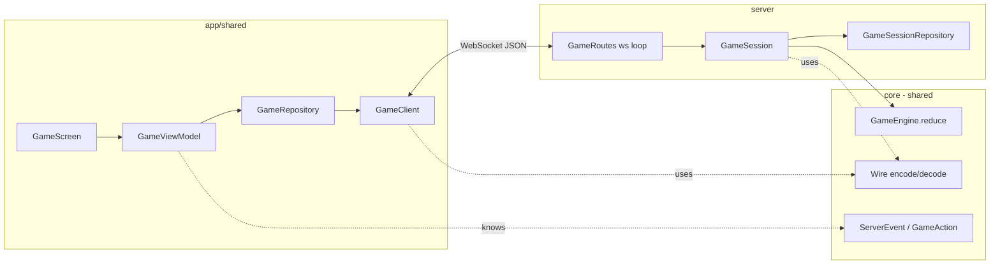
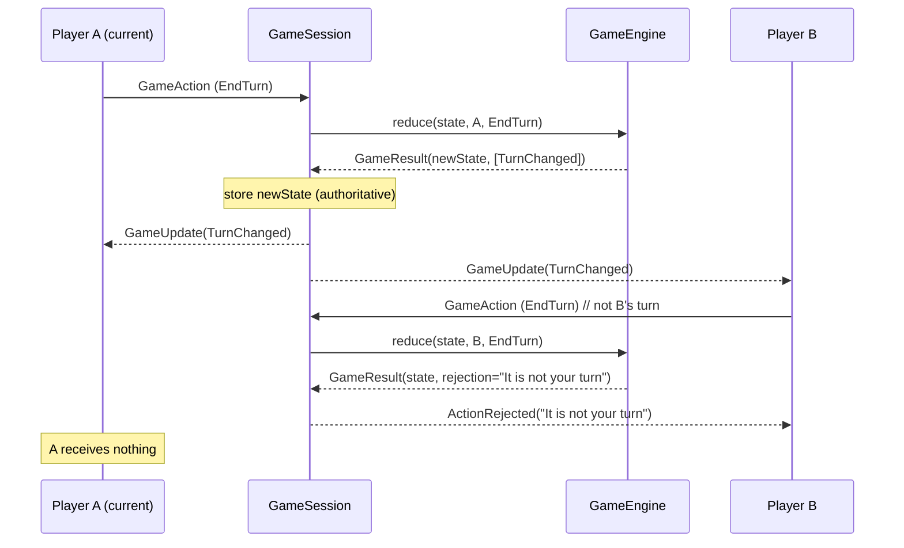
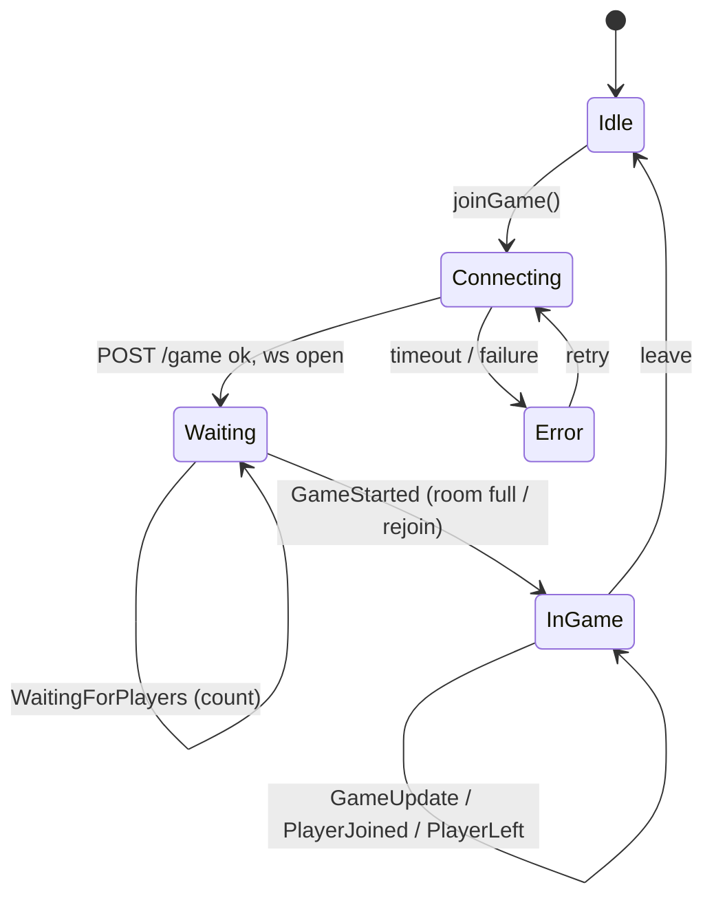

# HexonKMP Architecture

A multiplayer Catan built with Kotlin Multiplatform. This document explains how
the pieces fit together so the game logic can grow without touching networking.

## Guiding principle: separate *transport* from *game logic*

The system is split into two worlds that never leak into each other:

- **Transport / connection layer** — who is connected, sending and receiving
  bytes, matchmaking, reconnects. Lives in the **server** module and the client
  **data layer**. It knows nothing about Catan rules.
- **Game layer** — a *pure* engine that, given a state and an action, produces a
  new state and a list of events. Lives in **`core`** and is shared by both
  client and server. It knows nothing about sockets or coroutines.

The seam between them is one function:

```kotlin
fun reduce(state: GameState, actor: PlayerId, action: GameAction): GameResult
```

Everything Catan lives behind `reduce`. Everything network lives in front of it.

## Modules

```
core/        Shared KMP module — pure types + game engine + wire protocol.
             No server deps, no UI. Runs on every platform.
server/      Ktor (Netty) server. Owns connections + the authoritative state.
app/shared/  Compose Multiplatform client (Android, iOS, JVM, JS, wasmJs).
app/*App/    Thin per-platform launchers.
```

### Why the engine lives in `core` (shared)

Because both sides can run the same rules:

- **Server** runs `reduce` as the *source of truth*.
- **Client** can run the same `reduce` to pre-validate a move before sending it
  (instant feedback, optimistic UI) — using the exact same code, so they can
  never disagree about the rules.

## High-level flow



The client and server only ever exchange JSON-encoded `GameAction` (client →
server) and `ServerEvent` (server → client). `Wire` is the single place that
(de)serializes them, so the format is defined once.

## The two message sets

### `GameAction` (client → server) — `core/game/action/`
Player intents. The only thing a client can *do*.

```kotlin
sealed interface GameAction
data object EndTurn : GameAction
// future: RollDice, BuildRoad, BuildSettlement, Trade, ...
```

### `ServerEvent` (server → client) — `core/protocol/`
The transport envelope. Split by phase:

| Phase        | Events                                              |
|--------------|-----------------------------------------------------|
| Lobby        | `WaitingForPlayers(connected, needed)`, `GameStarted(state)` |
| Presence     | `PlayerJoined(playerId)`, `PlayerLeft(playerId)`    |
| Game updates | `GameUpdate(event)` wrapping a `GameEvent`, `ActionRejected(reason)` |
| Client-local | `ConnectionFailed(reason)` (never sent over the wire)|

### `GameEvent` (engine output) — `core/game/event/`
Pure domain deltas the engine emits. They describe *what changed* and have no
transport knowledge — the server wraps each one in a `GameUpdate` before sending.

```kotlin
sealed interface GameEvent
data class TurnChanged(val currentPlayer: PlayerId, val turn: Int) : GameEvent
```

> **Why three types instead of one?** `GameAction` is what players request,
> `GameEvent` is what actually happened (engine-authored, trustworthy), and
> `ServerEvent` is the transport wrapper that also carries non-game lifecycle
> messages. Keeping them separate means game rules never depend on networking.

## The engine (pure, testable) — `core/game/engine/`

```kotlin
interface GameEngine {
    fun initialState(players: List<PlayerId>): GameState
    fun reduce(state: GameState, actor: PlayerId, action: GameAction): GameResult
}

data class GameResult(
    val state: GameState,              // new state (== old if rejected)
    val events: List<GameEvent> = [],  // what to broadcast on success
    val rejection: String? = null,     // why it failed (sent only to the actor)
)
```

`reduce` is a **pure function**: no I/O, no shared mutable state, deterministic.
That makes the entire rulebook unit-testable without a server or a socket.



## Server responsibilities — `server/`

- **`GameRoutes`** — HTTP `POST /game` (matchmaking) and the WebSocket loop. The
  loop is *pure transport*: decode a frame into a `GameAction`, hand it to the
  session, repeat. No rules here.
- **`GameSession`** — owns the connections **and** the authoritative `GameState`,
  but contains **no rules**. It calls the engine and broadcasts the result. All
  state mutation happens under a `Mutex`; the actual socket sends happen *outside*
  the lock (snapshot recipients inside, send outside).
- **`GameSessionRepository`** — matchmaking: find-or-create a session, map
  `playerId → gameId` so a returning player rejoins the session they left.

### Connection lifecycle



`GameStarted` is **server-authoritative** and fires once when the room first
fills. A player who reconnects into a running game also gets `GameStarted` (with
the current snapshot) so their UI jumps straight into the board; everyone already
in the game just sees `PlayerJoined`. Catan-style, a player leaving does **not**
end the game for the others.

## Client responsibilities — `app/shared/`

- **`GameClient`** — opens the WebSocket, pumps outbound `GameAction`s, decodes
  inbound `ServerEvent`s via `Wire`.
- **`GameRepository`** — owns the connection coroutine, exposes a `Flow` of
  events, turns connection failures into a `ConnectionFailed` event so the UI can
  always leave its loading state.
- **`GameViewModel`** — folds `ServerEvent`s into a `GameUiState`. Applies each
  `GameUpdate` to its local copy of `GameState` (this is where the shared engine
  can later be reused for optimistic updates).
- **`GameScreen`** — renders the state; the "End Turn" button is enabled only on
  `isMyTurn`.

## Adding a new Catan action (the workflow)

This is the loop you'll repeat as the game grows:

1. **Model** any new state in `core/game/model/GameState.kt`.
2. **Action** — add a variant to `GameAction` (e.g. `data object RollDice`).
3. **Event** — add the resulting `GameEvent`(s) (e.g. `DiceRolled(a, b)`).
4. **Rule** — handle the action in `CatanGameEngine.reduce` (validate → produce
   new state + events, or a rejection). Add a unit test for it.
5. **Apply** — handle the new event in `GameViewModel.applyEvent` so the client
   updates its `GameState`.
6. **UI** — surface it in `GameScreen` (and a button/affordance to trigger the
   action).

Steps 1–4 are pure and unit-testable; only 5–6 touch UI. Networking never
changes — `GameUpdate` already carries any `GameEvent`.

## What is intentionally NOT here yet

- Real Catan domain: board (hex grid, tiles, number tokens), resources, hands,
  buildings, dev cards, robber, trading, victory points.
- Persistence (state is in-memory; a server restart loses games).
- Auth (the `playerId` from the query string is trusted as-is).
- Server-side reconnect of game state validation beyond the slot mapping.

These build on top of the seam above without reshaping it.
