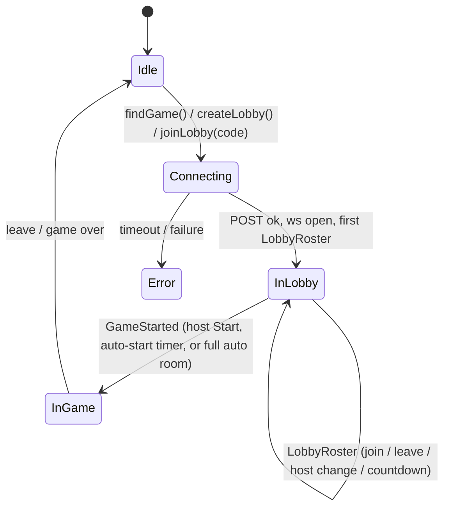

# Lobbies, Party Rules & the Turn Timer

How players get from the menu into a game, how a private-party host tunes the
rules, and how the per-turn clock works. This builds on the transport/game-logic
split in [architecture.md](architecture.md) — read that first for the `S/A/E`
generics, the `reduce` seam, and per-recipient redaction.

## Two lobby policies, one roster

There is **one** pre-game representation — a *roster* — with two policies, rather
than separate "matchmaking" and "private" concepts:

| Policy | How it starts | Host? | Join |
|--------|---------------|-------|------|
| **auto** (Find Game) | server arms an `autoStartDelaySeconds` countdown at `minPlayers`, then auto-starts; a full room starts instantly | none | `POST /game` |
| **manual** (private) | the host presses Start (only at ≥ `minPlayers`); no countdown, a full room does **not** auto-start | first reserver; promoted to the earliest remaining player if they leave | `POST /lobby` (create) / `POST /lobby/join` (by 6-digit code) |

Both are the same `GameSession` with a `manualStart: Boolean` flag. Every lobby
change broadcasts one event:

```kotlin
data class LobbyRoster(
    val members: List<LobbyMember>,   // id + display name, in join order
    val hostId: String?,              // null for auto/matchmaking
    val minPlayers: Int,
    val maxPlayers: Int,
    val countdownSeconds: Int?,       // auto-start only; client ticks it locally
) : ServerEvent<Nothing, Nothing>
```

Players **are** on the WebSocket during the lobby — it opens right after the HTTP
join, and `LobbyRoster` is pushed over it on every change. `LobbyRoster` is a
game-agnostic lifecycle event (`ServerEvent<Nothing, Nothing>`), like presence and
`TurnTimer`. Lifecycle (create / join / start) stays on **HTTP**; the WebSocket
carries lobby roster pushes and in-game actions.



## Party rules (host-configurable)

A private host can tune two rules before the game starts:

```kotlin
data class PartyRules(
    val victoryPoints: Int,        // win target
    val turnTimerSeconds: Int?,    // per-turn clock; null = no timer
)
```

- **Host-local, sent once at Start.** The host edits the rules entirely on their
  own device — there is **no per-change traffic** and only the host sees them.
  They ride along with `POST /lobby/start { gameId, rules }`; the server applies
  them in `startByHost` (a null `rules`, or a non-host start, falls back to the
  mode defaults). This deliberately avoids the chatty alternative of POSTing +
  rebroadcasting the roster on every tweak.
- **Applied at Start.** The chosen `victoryPoints` is baked into the engine's
  `RuleConfig` when it's created (see below); `turnTimerSeconds` drives the clock.
- The client `RulesPanel` (host only) uses **scroll selectors**: victory points
  `5..12` (step 1, default 10) and the turn timer `No timer` then `+10s` steps
  (default `No timer`).

### Keeping the session game-agnostic for VP overrides

The win target is an *engine rule* (`RuleConfig.victoryPointsToWin`), but the
generic `GameSession` mustn't know Catan. So the session is built with an **engine
factory** instead of a fixed engine:

```kotlin
// GameSession constructor (generic over S/A/E):
engineFor: (victoryPoints: Int?) -> GameEngine<S, A, E>   // null = mode default
```

The session calls `engineFor(rules.victoryPoints)` **at start**, so the override
bakes into the engine's rules without the session ever naming a Catan type. The
factory is assembled in the server's `AppModule` — still the one Catan-aware spot:

```kotlin
engineFor = { vp ->
    val rules = config.rules.copy(victoryPointsToWin = vp ?: config.rules.victoryPointsToWin)
    CatanGameEngine(config.copy(rules = rules))
}
```

The turn duration, by contrast, doesn't need the engine — the session runs the
clock itself with `turnTimerSeconds` as a plain `Int?` (like the matchmaking
ints), so no engine rebuild is involved.

## The turn timer

A server-authoritative per-turn clock. `RuleConfig.turnTimerSeconds` defaults to
**45s** and applies to *all* games (including Find Game); private hosts override
or disable it. `null` = manual: turns end only when the player acts.

### The generic seam: `timerKey` / `onTimeout`

The generic session can't see "the situation changed" or know what to auto-do on
expiry without game knowledge. Two default hooks on `GameEngine<S, A, E>` bridge
that — the same pattern as `reduce`/`playerLeft`: pure, game-supplied.

```kotlin
interface GameEngine<S, A, E> {
    // …initialState / reduce / playerLeft / playerJoined…
    fun timerKey(state: S): Any? = null               // identifies the timed situation; null = no clock
    fun onTimeout(state: S): List<TimeoutAction<A>> = emptyList()  // actions to auto-apply on expiry
}
data class TimeoutAction<out A>(val actor: PlayerId, val action: A)
```

The transport runs **one clock per distinct `timerKey`** and resets it whenever the
key changes — so a fresh situation (a new turn, or a discard round) gets a fresh
clock. `onTimeout` returns a *list* (one action per actor), so a single expiry can
resolve **several players at once** — that's what makes the global discard round
work. The actions run through the **normal `reduce`** path: the player stays in the
game, it is **not** the `playerLeft` path.

`CatanGameEngine` implements both by **reusing the existing legal-move queries** —
no new rules, deterministic choices (first legal option) to stay pure:

| Phase | `timerKey` | `onTimeout` |
|-------|-----------|-------------|
| `Play` | `turn:<n>:<player>` | `EndTurn` (dice auto-roll at turn start, so always legal) |
| `Robber` | (same as the turn — robber is part of it) | `MoveRobber(any other tile)` (auto-steal follows) |
| `ChooseStealTarget` | (same as the turn) | `StealFrom(first eligible victim)` |
| `RoadBuilding` / `Setup` | (same as the turn) | first legal `PlaceRoad` / `PlaceSettlement` |
| `Discard` | `discard:<n>` (its own clock) | a `DiscardResources` for **every present player who still owes**, the required count picked by hand order |
| `Finished` | `null` (no clock) | — |

Because `Robber`/`ChooseStealTarget`/`RoadBuilding` share the turn's key, the clock
covers the whole turn (the active player has one budget for it all). `Discard` has a
distinct key, so entering it starts a **fresh global countdown** that waits on
everyone and, on expiry, discards for all remaining owers in one pass.

### Running the clock (server)

`GameSession` owns the clock alongside its existing matchmaking countdown:

- `armTurnTimerLocked()` runs after **every** state change (start, each applied
  action, `playerLeft`). It re-arms **only when `timerKey` changes** — so the clock
  covers a whole turn / whole discard round, not each intermediate build or
  individual discard.
- On expiry, `fireTimeout(key)` calls `engine.onTimeout` and applies each
  `(actor, action)` through the **normal action path** (broadcasting events +
  re-arming for whatever's next); a stale fire (the situation already moved on) is
  ignored.
- Each (re)arm broadcasts a lifecycle event carrying the **remaining seconds**, so
  clients anchor a countdown to their own clock (no cross-device skew):

```kotlin
data class TurnTimer(val remainingSeconds: Int?) : ServerEvent<Nothing, Nothing>
// null = no clock running (manual mode, or game over)
```

```mermaid
sequenceDiagram
    participant A as Roller
    participant Srv as GameSession
    participant Eng as GameEngine
    participant B as Other owers
    Note over Srv: A rolls a 7 -> Discard round; fresh global clock armed
    Srv-->>A: TurnTimer(45)
    Srv-->>B: TurnTimer(45)
    alt everyone discards in time
        A->>Srv: DiscardResources(...)
        B->>Srv: DiscardResources(...)
        Note over Srv: no one owes -> Robber; clock re-armed for A
    else clock expires
        Note over Srv: timer fires
        Srv->>Eng: onTimeout(state) -> a DiscardResources per remaining ower
        Srv->>Eng: reduce(...) for each, in order
        Note over Srv: discard round done -> Robber; clock re-armed
    end
```

### Rendering the countdown (client)

- `TurnTimer` is broadcast right after `GameStarted`, so it can race the game
  screen mounting — the same handoff hazard as the start snapshot. The repository
  caches the latest reading (`startedTurnRemainingSeconds`) and the `GameViewModel`
  seeds from it, then folds later `TurnTimer` events into `GameUiState.InGame`.
- `InGame` carries `turnRemainingSeconds` plus a `turnTimerToken` that bumps on
  every `TurnTimer`, so the local countdown restarts each turn even when
  consecutive turns share a duration.
- `rememberTurnCountdownLabel(remaining, token)` (in `PhasePill.kt`) ticks down
  once a second and renders `M:SS`, or `∞` for manual. Both game headers use it.

## Notes

- **No timer (`turnTimerSeconds == null`)** disables every auto-resolution: turns,
  robber moves and discard rounds all wait indefinitely for input (leavers are
  still auto-resolved via `playerLeft`, as before). The clock is the only thing
  that forces a move — it never treats a present player as having left.
- The clock generalizes cleanly: a future phase that needs a deadline just gives it
  a `timerKey` and returns its auto-resolution from `onTimeout` — no transport
  changes.
